## Content

- Introduction Text Visualisation
  - Text data
- Text Visualisation Methods
  - Tag Cloud
  - Wordle
  - Word Tree
  - Phrase Nets
- R Packages for Text Visualisation

## Introduction to Text Visualisation

### History of text

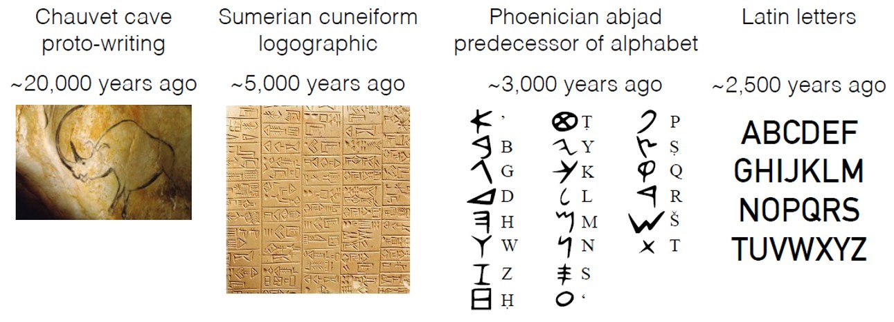

------------------------------------------------------------------------

### Text as historical archive

------------------------------------------------------------------------

### Text as a mode of communication

------------------------------------------------------------------------

### Textual data for business intelligence analytics

------------------------------------------------------------------------

### Why Visualise Text?

- Understanding – get the “gist” of a document
- Grouping – cluster for overview or classification
- Compare – compare document collections, or
- Inspect evolution of collection over time
- Correlate – compare patterns in text to those in other data, e.g., correlate with social network

------------------------------------------------------------------------

### Levels of Text Representation

- Lexical level, transforming a string of characters into a sequence of atomic entities, called tokens.
- Syntactic level, identifying and tagging (anotating) each token’s functions.
- Semantic level, extracting of meaning and relationships between pieces of knowledge derived from the structures identified in the syntactical level.

------------------------------------------------------------------------

### Fundamental of Text Visualisation

Be warn, not all text are written in English and in digital forms!

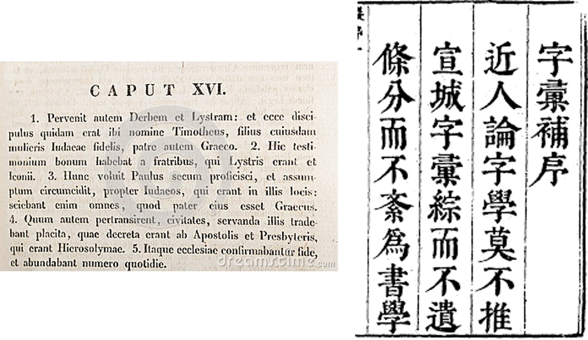

## Text Visualisation Methods

- Tag Cloud
- Wordle
- Word Tree
- Phrase Nets

------------------------------------------------------------------------

### Tag Cloud

- A tag cloud (word cloud, or weighted list in visual design) is a visual representation for text data, typically used to depict keyword metadata (tags) on websites, or to visualize free form text.
- 'Tags' are usually single words, normally listed alphabetically, and the importance of each tag is shown with font size or color.

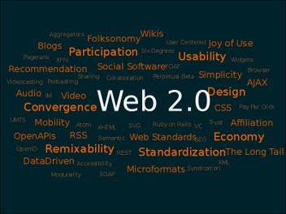

::: {style="font-size: 0.65em"}
Source: [Tag cloud](http://en.wikipedia.org/wiki/Tag_cloud)
:::

------------------------------------------------------------------------

### Application of Tag Cloud I: Branding

- One-word tag cloud of DBS’s corporate values statement created using Many Eyes.

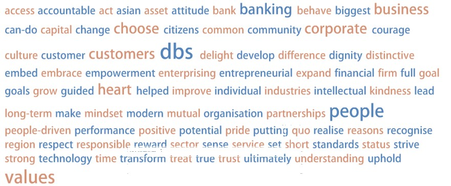

------------------------------------------------------------------------

### Application of Tag Cloud I: Branding

- Two-word tag cloud of DBS’s corporate values statement created using Many Eyes.

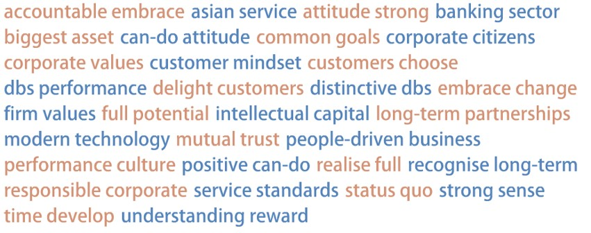

## Wordle

- A toy for generating “word clouds” from text that you provide

------------------------------------------------------------------------

### Word Clouds of Corporate Values Statements

::::: columns
::: {.column width="50%"}
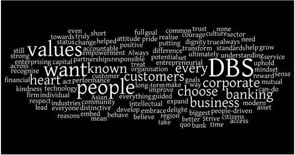
:::

::: {.column width="50%"}
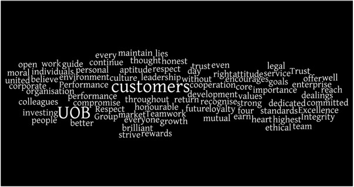
:::
:::::

------------------------------------------------------------------------

### Word Tree

- A visual search tool for unstructured text, such as a book, article, speech or poem. It lets you pick a word or phrase and shows you all the different contexts in which the word or phrase appears.
- The contexts are arranged in a tree-like branching structure to reveal recurrent themes and phrases.

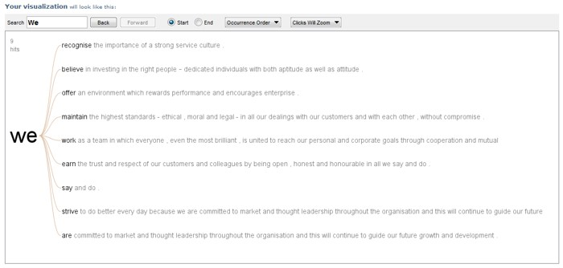

::: {style="font-size: 0.65em"}
Source: [wordtree](https://www.jasondavies.com/wordtree/)
:::

------------------------------------------------------------------------

### Phrase Net

- A phrase net diagrams the relationships between different words used in a text. It uses a simple form of pattern matching to provide multiple views of the concepts contained in a book, speech, or poem.

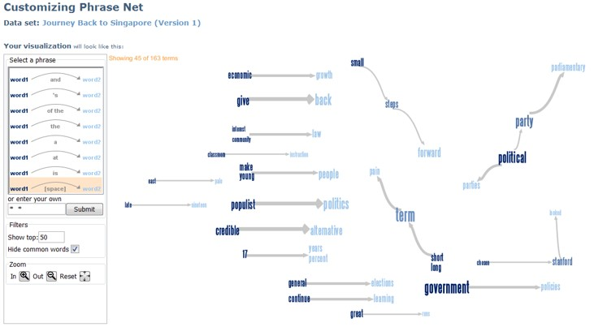

------------------------------------------------------------------------

### Phrase Net

::::: columns
::: {.column width="50%"}
Words separate by the keyword "and"

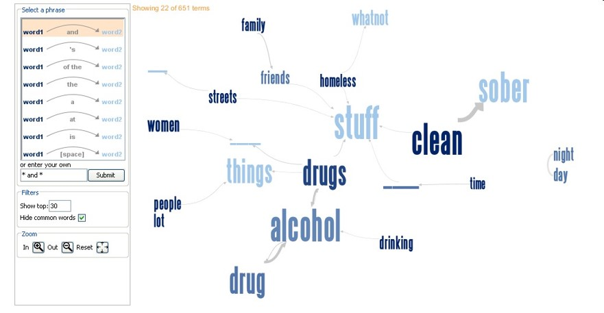
:::

::: {.column width="50%"}
Words that directly follow one another

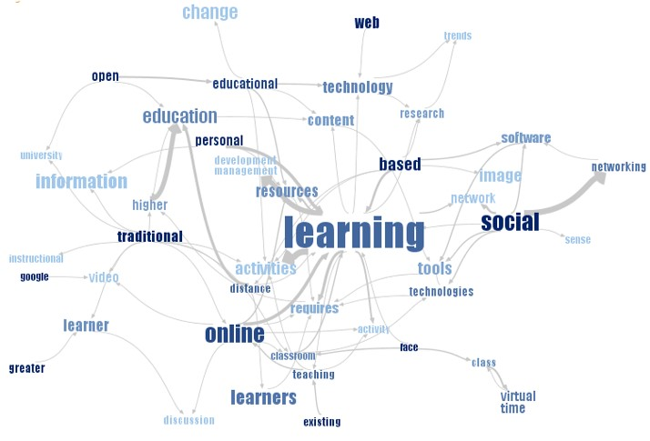
:::
:::::

------------------------------------------------------------------------

### Parallel Tag Cloud

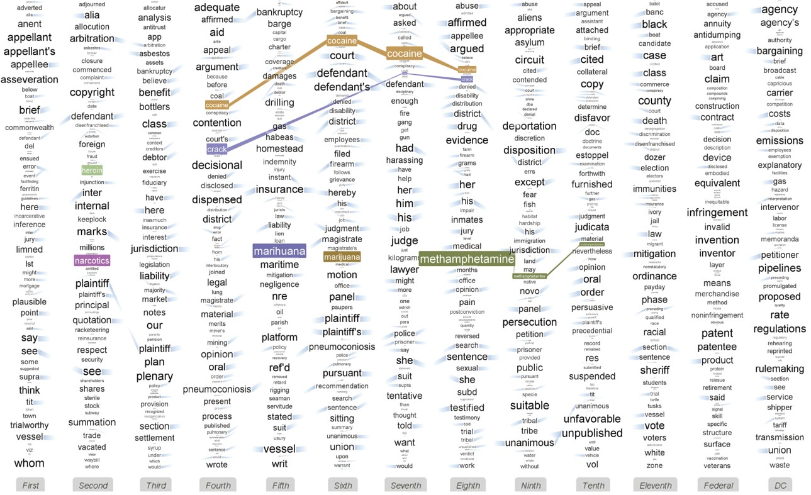

::: {style="font-size: 0.65em"}
Reference: [Parallel Tag Clouds to Explore and Analyze Faceted Text Corpora](http://vialab.science.uoit.ca/wp-content/papercite-data/pdf/col2009b.pdf)
:::

------------------------------------------------------------------------

### Story Tracker: Main View

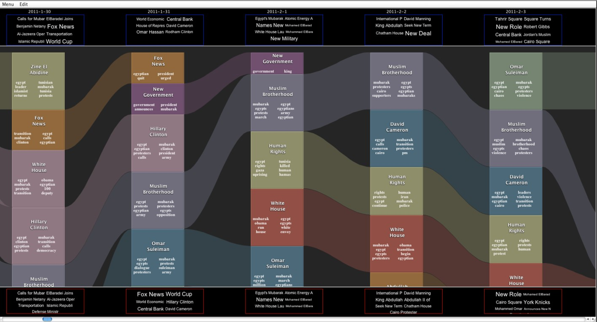

::: {style="font-size: 0.65em"}
Reference: [Story Tracker: Incremental visual textanalytics of news story development](https://kops.uni-konstanz.de/bitstream/handle/123456789/26224/Krstajic_262244.pdf?sequence=2)
:::

## R packages for Text Visualisation

- ggwordcloud: a word cloud geom for ggplot2
- TextPlot: An R package for Visualizing Text Data
- corporaexplorer: An R package for dynamic exploration of text collections
- LDAvis: An R package for interactive topic model visualization

------------------------------------------------------------------------

### wordcloud

- Provides functionality to create pretty word clouds, visualize differences and similarity between documents, and avoid over-plotting in scatter plots with text.
- Visit this [link](https://cran.r-project.org/web/packages/wordcloud/) for more information.

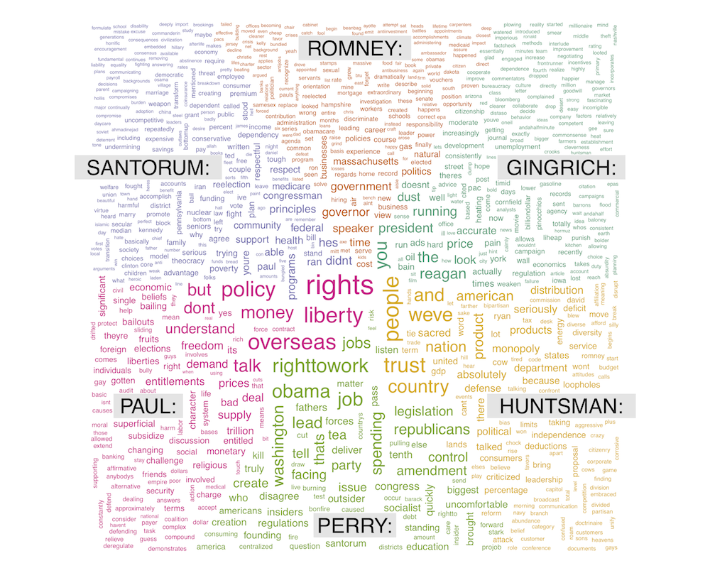

------------------------------------------------------------------------

### wordcloud2: Create Word Cloud by 'htmlwidget'

- A fast visualization tool for creating wordcloud by using [wordcloud2.js](https://timdream.org/wordcloud2.js/), ia JavaScript library to create wordle presentation on 2D canvas or HTML.
- It provides Shiny functions.
- Visit this [link](https://cran.r-project.org/web/packages/wordcloud2/vignettes/wordcloud.html) for more information.

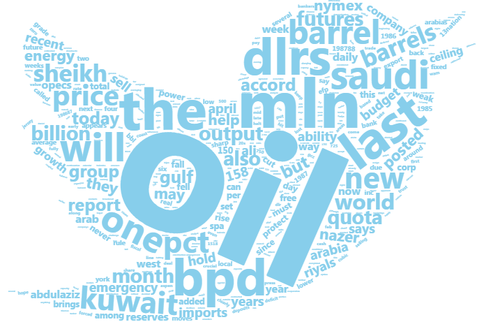

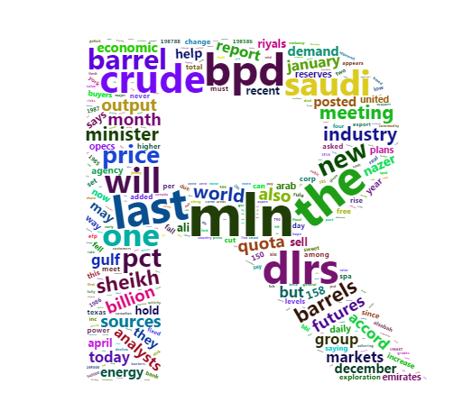

------------------------------------------------------------------------

### ggwordcloud: a word cloud geom for ggplot2

- [ggwordcloud](https://cran.r-project.org/web/packages/ggwordcloud/vignettes/ggwordcloud.html) provides a word cloud text geom for ggplot2.
- as an alternative to [wordcloud](https://cran.r-project.org/web/packages/wordcloud/) and [wordcloud2](https://cran.r-project.org/web/packages/wordcloud2/).

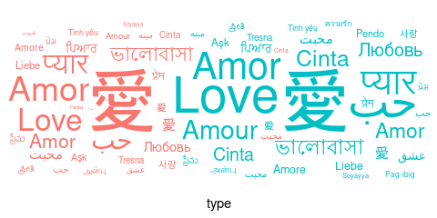

------------------------------------------------------------------------

### Wordcloud on Shiny

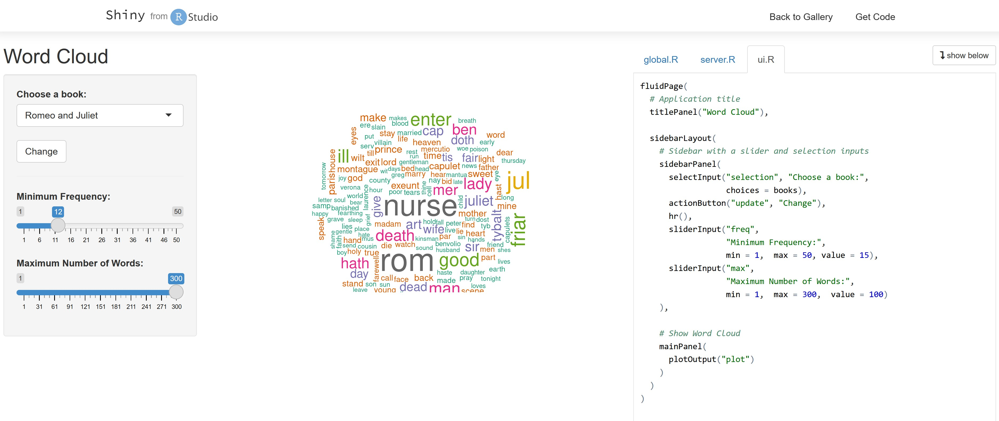

For live demo, visit this [link](https://shiny.rstudio.com/gallery/word-cloud.html)

------------------------------------------------------------------------

### TextPlot: R Library for Visualizing Text Data

- Aims to visualise complex relations in texts.

- Provides functionalities for displaying text co-occurrence networks, text correlation networks, dependency relationships as well as text clustering.

- Visit this [link](https://cran.r-project.org/web/packages/textplot/index.html) for more information.

- This example visualises the result of a text annotation which provides parts of speech tags and dependency relationships.

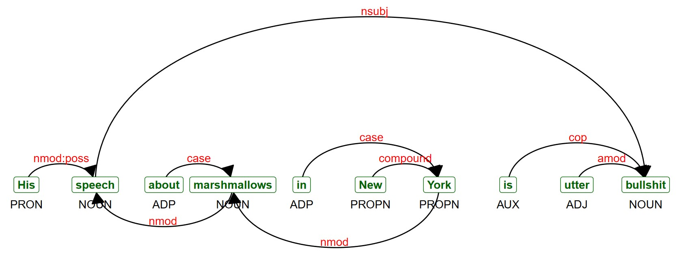

------------------------------------------------------------------------

### TextPlot

- This example shows plotting a biterm topic model which was pretrained and put in the package as an example.

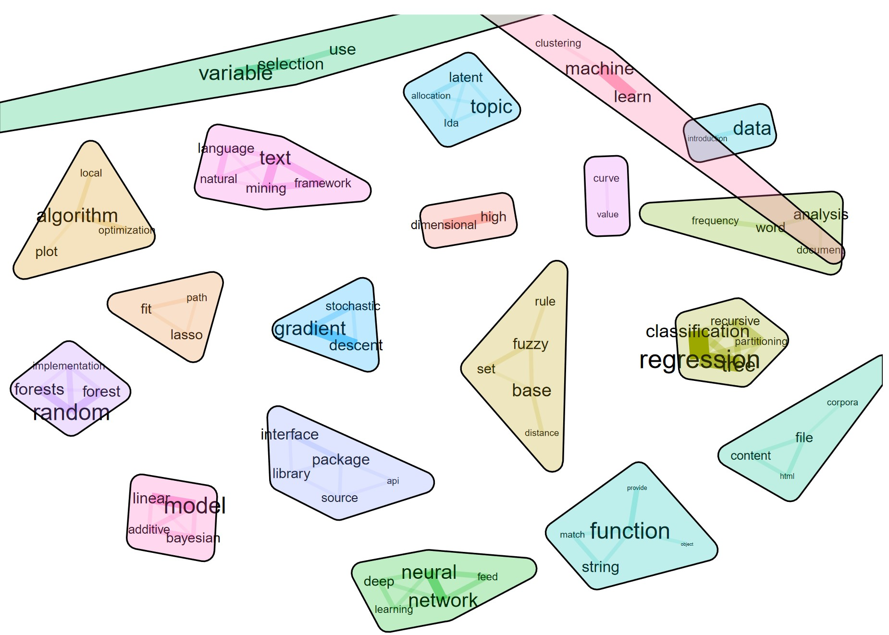

------------------------------------------------------------------------

### TextPlot

- The following graph shows how frequently adjectives co-occur across all the documents.

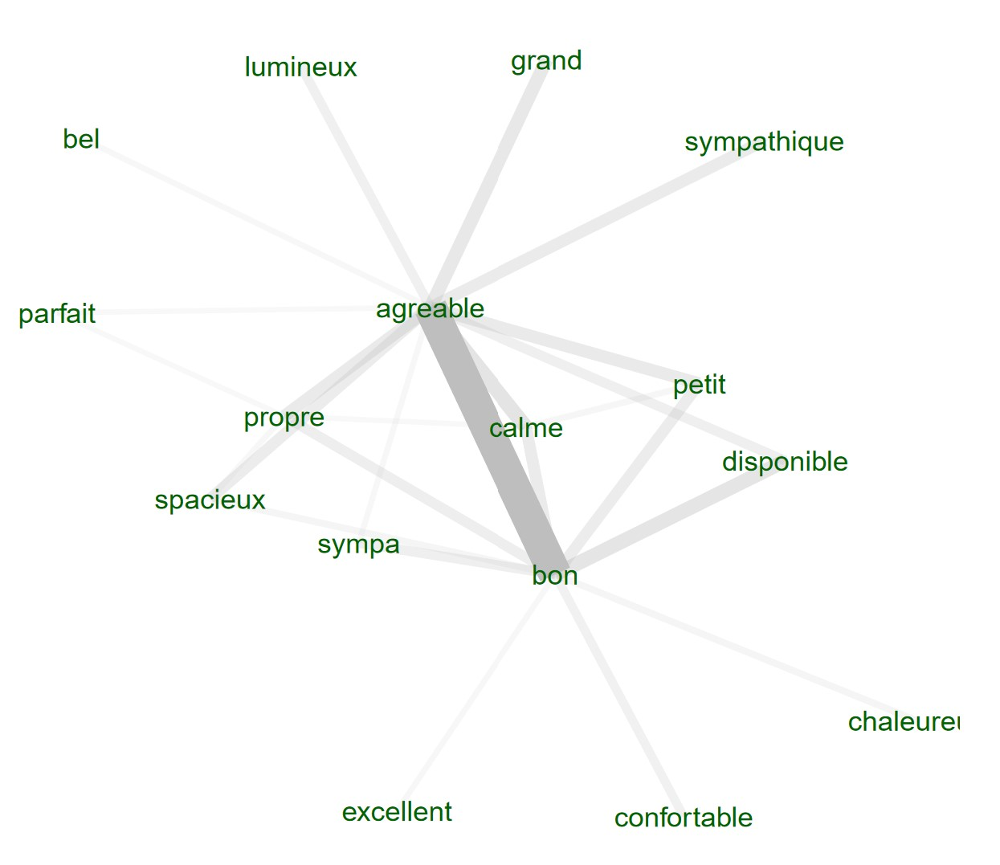

------------------------------------------------------------------------

### corporaexplorer: An R package for dynamic exploration of text collections

- [corporaexplorer](https://kgjerde.github.io/corporaexplorer/) is an R package that uses the Shiny graphical user interface framework for dynamic exploration of text collections.
- It’s intended primary audience are qualitatively oriented researchers who rely on close reading of textual documents as part of their academic activity.

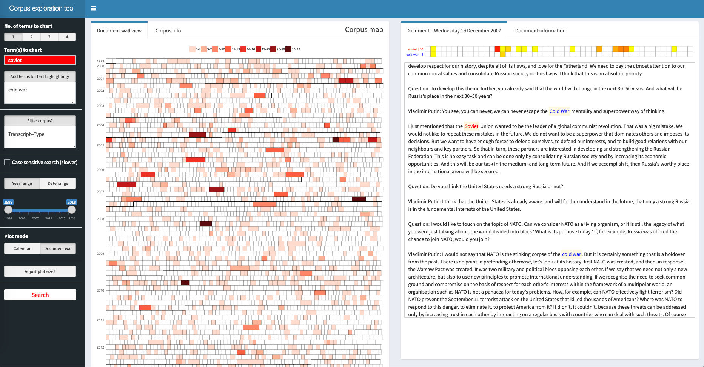

------------------------------------------------------------------------

### textnets

:::::: columns
:::: {.column width="50%"}
- R package for automated text analysis using network techniques.
- Visit the [github](https://github.com/cbail/textnets) repository for more information.\
- Notice that this package is not on cran yet. You need to install it by using the code *install_github("cbail/textnets")*.

::: {style="font-size: 0.65em"}
Reference: Bail, Christopher A. (2016) ["Combining Network Analysis and Natural Language Processing to Examine how Advocacy Organizations Stimulate Conversation on Social Media."](https://www.pnas.org/content/pnas/113/42/11823.full.pdf?with-ds=yes) *Proceedings of the National Academy of Sciences*, 113:42.
:::
::::

::: {.column width="50%"}
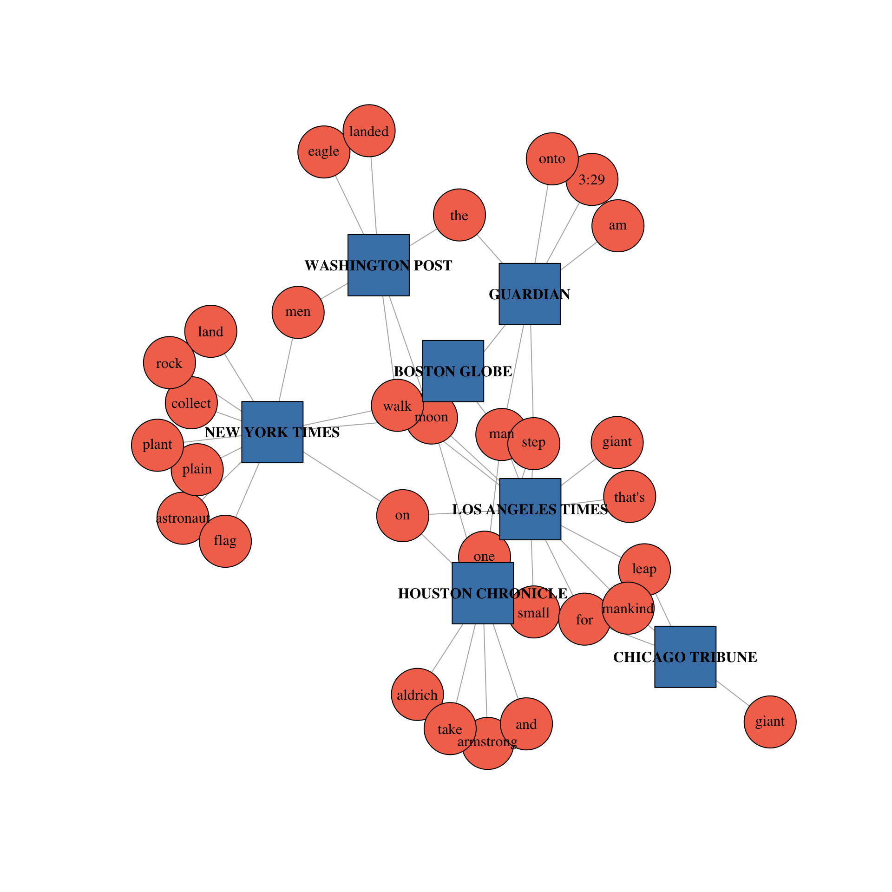
:::
::::::

------------------------------------------------------------------------

### LDAvis

- R package for interactive topic model visualization.
- Visit the [github](https://github.com/cpsievert/LDAvis) repository and [cran](https://cran.r-project.org/web/packages/LDAvis/index.html) for more information.

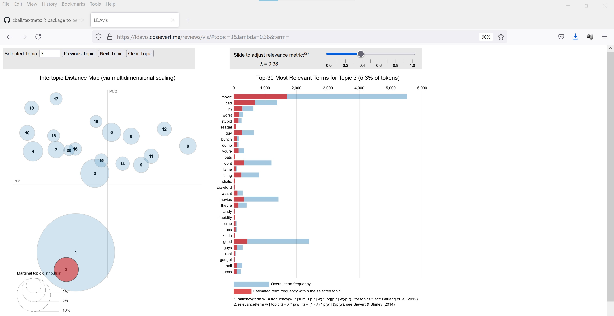

::: {style="font-size: 0.65em"}
Source: For live demo, visit this [link](https://ldavis.cpsievert.me/reviews/vis/#topic=3&lambda=0.38&term=).
:::

## References

Cao, Nan and Cui, Weiwei (2016) **Introduction to text visualization**, Springer. This book is available at smu [e-collection](https://link-springer-com.libproxy.smu.edu.sg/content/pdf/10.2991%2F978-94-6239-186-4.pdf).
