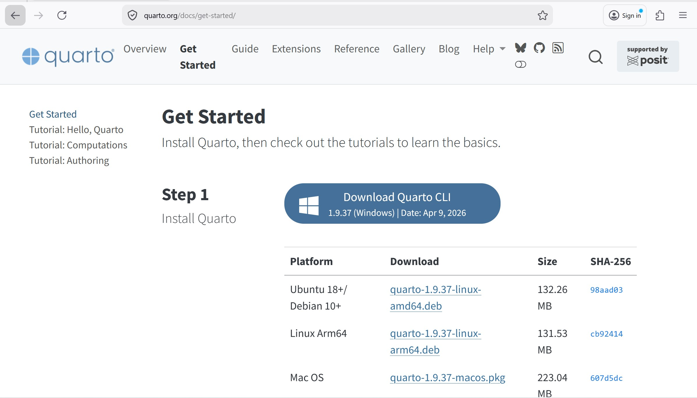
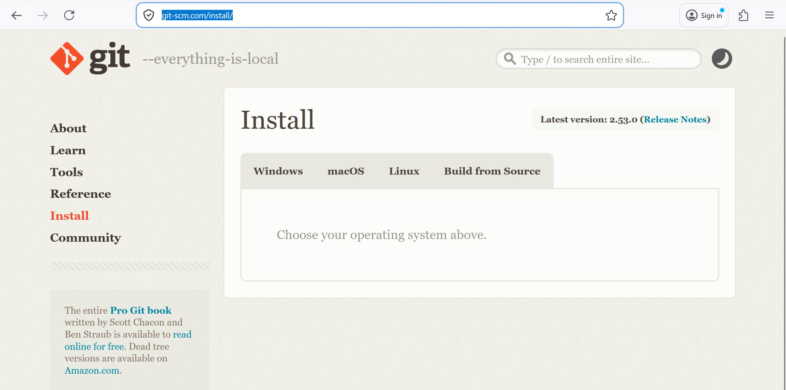
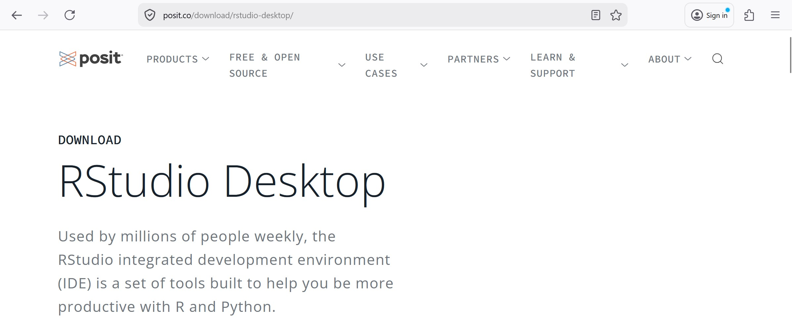

## Content

- Installing and Setting Up R
- Installing RTools
- Installing git
- Signing-up github account
- Installing RStudio
- Setting-up git in RStudio
- Installing Quarto
- Creating coursework website with Quarto
- Rendering and pushing to github
- Signing-up Vercel account
- Deploying the coursework website on Vercel

## Installing and Setting R

-   Download R installer by visiting one of the following links:

    -   [Windows user](https://cran.r-project.org/bin/windows/base/)

    -   [MacOS user](https://cran.r-project.org/bin/macosx/)

-   Install R by clicking on the installer. If necessary, provide the installer administrator right. Install R in the root directory when prompted.

-   After the installation completed, check the environment variable of your computer. If R path is not defined, you should update the path manually.

{fig-align="center"}

## Installing Rtools

-   A toolchain bundle used for building R packages from source (those that need compilation of C/C++ or Fortran code) and for build R itself.

-   Download RTools from this [site](https://cran.r-project.org/bin/windows/Rtools/).

-   After the installation complete, check the environment variable of your computer to ensure that RTools path is there.

{width="800"}

## Downloading and Installing Quarto

-   Visit this [site](https://quarto.org/docs/get-started/) and download the Quarto of your choice.

## Downloading and Installing git

-   Visit this [site](https://git-scm.com/install/) and download git installer of your choice.

## Signing-up github account

-   Visit this [site](https://github.com/) and sign-up a github account.

## Downloading and Installing RStudio

-   Visit this [site](https://posit.co/download/rstudio-desktop/), download and install the version of RStudio Desktop supporting the OS of your laptop.

